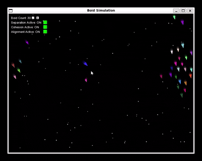

# Stellar Fleet: An Interactive Boids Simulation

This is a real time, space themed flocking simulation built using C++ and SFML. The project implements **Craig Reynolds'**
classic **"Boids"** algorithm to model the emergent behaviour of a fleet of spaceships, creating complex, life-like motion
from a simple set of rules.

### Creating the Project

This project began as an exploration into **Craig Reynolds'** Boids algorithm and learning more about the uses of it. After
some research I decided to create a Boid simulation to better demonstrate my understanding on the boids algorithm but also showcase my 
core object-oriented programming, vector math and algorithmic skills. After creating a simple boid simulation I decided to give it a theme
and provide it a life to make more interactive instead of a stale state screen. Which led me to turning the simulation into space themed.

The simulation features a procedurally generated "fleet" of boids, each navigating a 2D space according to three simple rules
which you can toggle in real-time using UI.

#### Key features

**Classic Flocking AI**: Boids follow the three core rules of emergent behaviour:
- **Cohesion**: Steering to move toward the average position of local flockmates.
- **Separation**: Steering to avoid crowding local flockmates.
- **Alignment**: Steering towards the average heading of local flockmates.

**Interactive Physics**: The user can directly influence the simulation in two ways:
- **Flee Behaviour**: The entire flock will realistically scatter and flee from the user's mouse cursor.
- **Black Hole**: Holding the left mouse button summons a "Black Hole" gravity well that attracts all nearby boids.

**Dynamic Environment**:
- **Procedural Starfield**: The background is populated with a randomly generated starfield.
- **Motion Trails**: Boids leave a smooth visual trail, creating a sense of speed and motion. This is achieved using a stable `sf::RenderTexture` implementation.

**Real-Time UI Control Panel**: An interactive UI panel allows the user to toggle the core flocking rules on and off, demonstrating
their effects on the simulation's behaviour instantly.

#### Technical Skills
- Language: C++
- Graphics & Windowing: SFML
- Build System: CMake

### How To Build and Run

#### Prerequisites
- C++ compiler (GCC, Clang, MSVC)
- CMake (3.10+)
- SFML libraries installed on your system.

#### Steps
1. Clone the repository:
    `git clone [your-repo-link-here]`  

2. Navigate to the project directory:
    `cd boidSimulation`  

3. Create and navigate to a build directory:
    `mkdir build && cd build`  

4. Run CMake to configure the project. You may need to specify the path to your SFML installation:
    `cmake .. -D SFML_DIR=/path/to/your/sfml/lib/cmake/SFML`  

5. Compile the project:
    `cmake --build .`  

6. Run the executable from the build directory:
    `./boidSimulation`  
